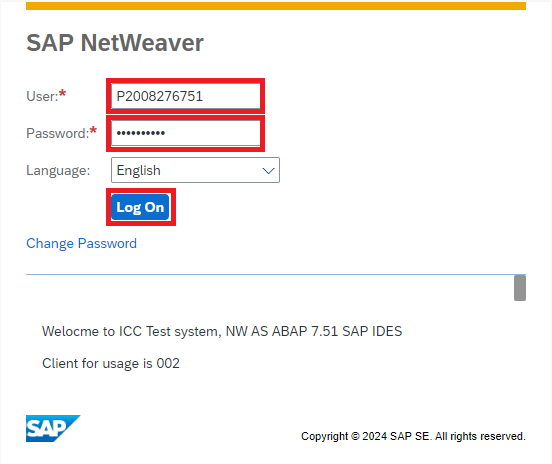
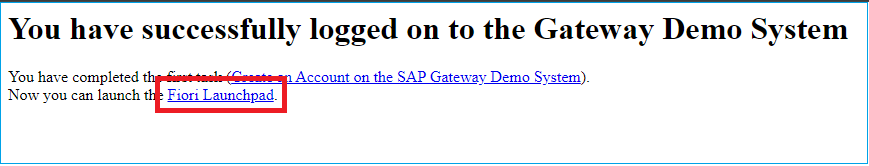
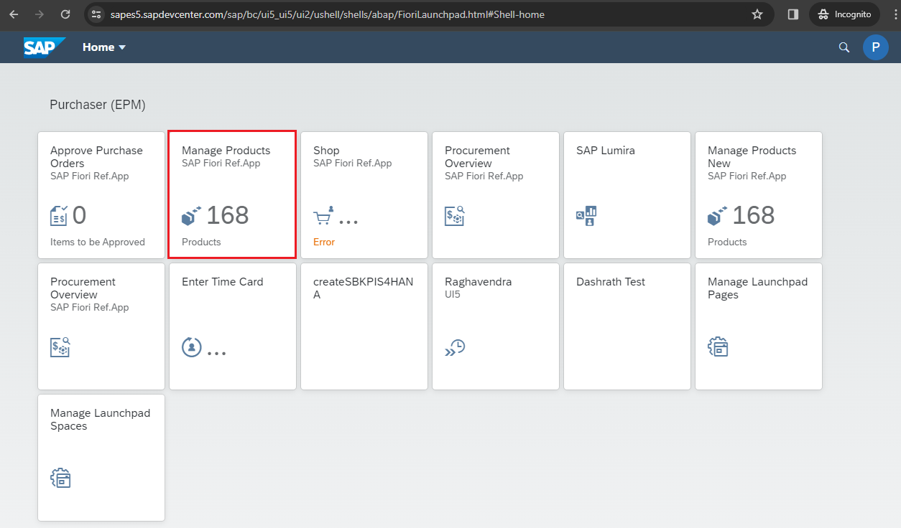
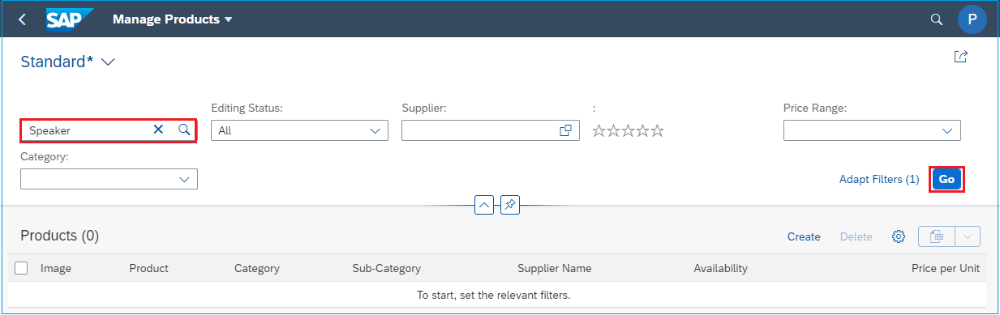
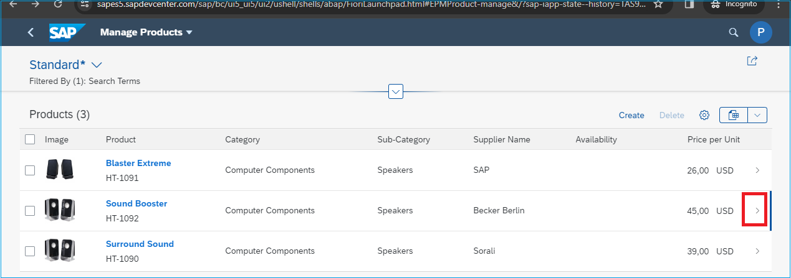
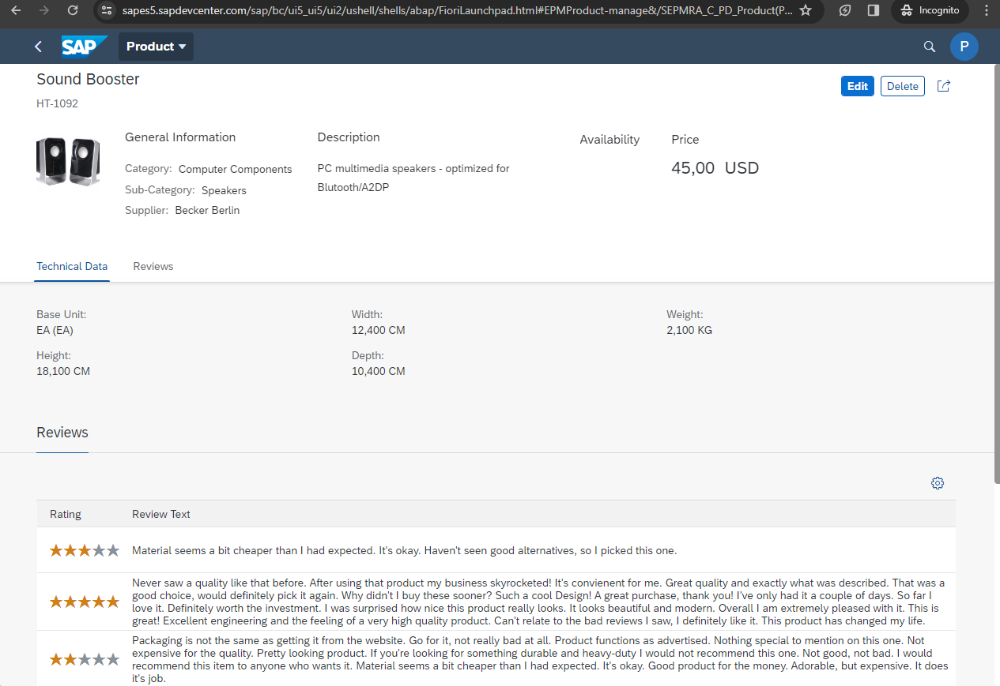

 # Quest 1 - Get familiar with SAP Fiori UI

**[🏠Home](../README.md)** - [ Quest 2 >](quest2.md)


* We start our journey by logging into the SAP Netweaver demo system ES5 and checking out some products with SAP Fiori. 
  

* Open a browser in Incognito Mode

* Open the ES5 Webgui and `sign in` with user P2008276751 and password provided by your mentors.
 ```http
  https://sapes5.sapdevcenter.com/sap/bc/gui/sap/its/webgui
  ```
 


* Launch Fiori Launchpad



* Select "Manage Products"


* Filter for "Speaker":



* View product details be `clicking` on the ">" right hand site of the product



* On the next screen you can view the product details. Check out the price. 



## Where to next?

**[🏠Home](../README.md)** - [ Quest 2 >](quest2.md)

[🔝](#)
