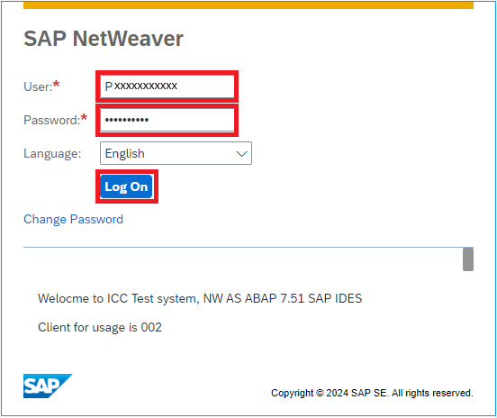

 # Quest 1 - Get familiar with SAP Fiori UI

**[🏠Home](../README.md)** - [ Quest 2 >](quest2.md)


* We start our journey by logging into the SAP Netweaver demo system ES5 and checking out some products with SAP Fiori. 
  

* Open a browser in Incognito Mode

* Open the ES5 Webgui and `sign in` with user P2008276751 and password provided by your mentors.
 ```http
  https://sapes5.sapdevcenter.com/sap/bc/gui/sap/its/webgui
  ```
 


* Launch Fiori Launchpad


* Select "Manage Products"


* Filter for "Speaker":


* View product details be `clicking` on the ">" right hand site of the product


* Since we want to use this image as an icon for our Chatbot in the next Quest, we need to resize it quite a bit. Since we don't want to install any other tools we will just use any Online resizing tool (feel free to use anything else). For this go to [ImageResizer](https://imageresizer.com/) and select the image that you just downloaded


* Since we need a rather small image, select enter `70` for the Width and click on `Resize Image` 


* Now you should have a much smaller image, that you can download by clicking on `Download image`. We will use this new icon later on. 


## Where to next?

**[🏠Home](../README.md)** - [ Quest 2 >](quest2.md)

[🔝](#)
