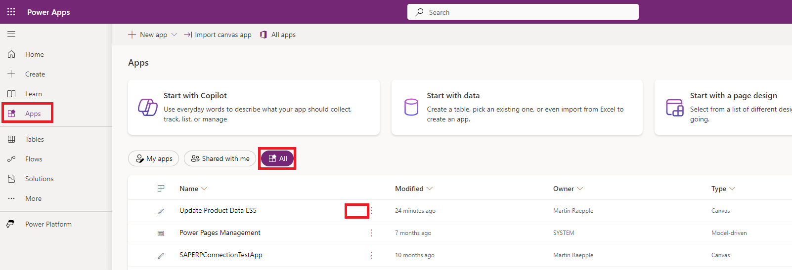

# Quest 2 - Create a new product in SAP

[ < Quest 1 ](quest1.md) - **[ Quest 3 > ](quest3.md)**

With this first experience in SAP Fiori, we would likec to create a new product in SAP. To simplify the process we created a Power App for this task.

* Open https://powerapps.com/ and log in with your "Group User"). 

* Slide over `Update Product Data ES5` and click `Play`  
   

* Click `Refresh`   
   

* Click the `>` behind any existzing product   
   

* xxx   
   

* xxx   
   

* xxx   
   

* xxx   
   
 

* xxx   
   
 

* xxx   
   

## Where to next?
[ < Quest 1 ](quest1.md) - **[ Quest 3 > ](quest3.md)**

[🔝](#)
