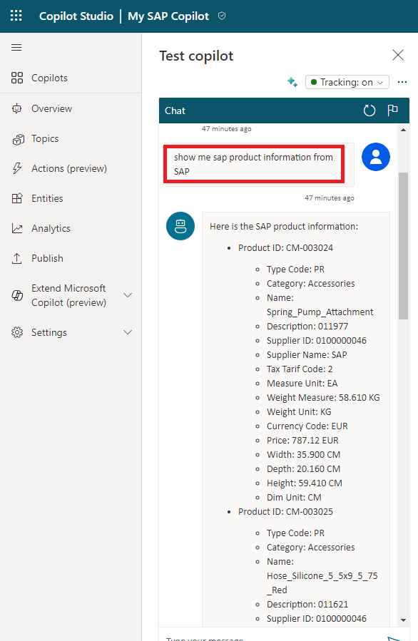

# Quest 4 - Chat against SAP Product 

[ < Quest 3 ](quest3.md) - **[🏠Home](../README.md)**

As your SAP Product Copilot and Power Automate Flow are configured and you can chat with your SAP data. 

* Switch back to "Copilot" tab
* Query a dedicated product HT-1000 `show me sap product information from SAP for product HT-1000`
* Query you product ID you created in Quest 2 `show me sap product information from SAP for product <your product ID>`
   

* xxx
   

* xxx
   

* xxx
   

* Test the bot on the demo site
   

> [!TIP]
>🏆Finish the final quest and send [us](mailto:holger.bruchelt@microsoft.com) a link to your bot to claim [your badge](https://webhostingforconverter.z16.web.core.windows.net/claim-reward-chatgpt.html) 😎 May the ninja-cat be with you.

## Where to next?

[ < Quest 3 ](quest3.md) - **[🏠Home](../README.md)**

[🔝](#)
